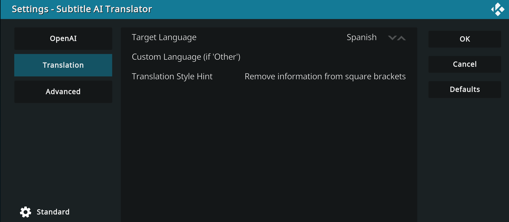
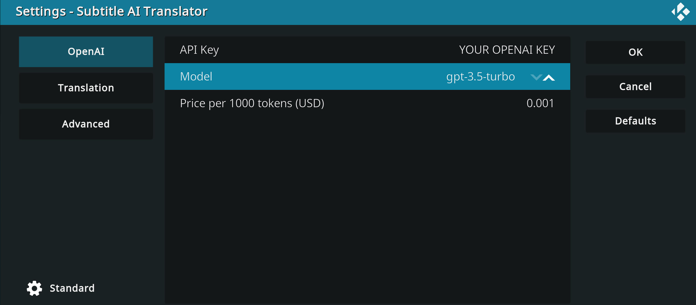
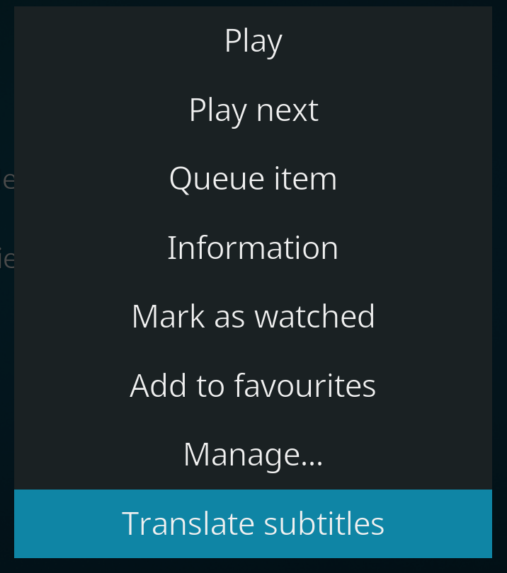
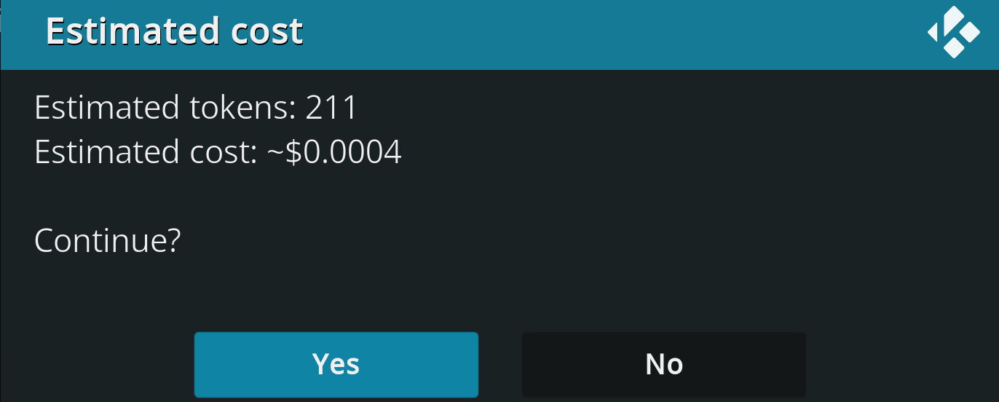

# 🧠 Subtitle AI Translator (Kodi Add-on)

**Subtitle AI Translator** is a smart, user-friendly **Kodi add-on** that enables you to **translate subtitle files using Large Language Models (LLMs)** — currently supporting **OpenAI's GPT models** and **Google's Gemini API**.

It’s especially useful for users who want to enjoy movies and shows with subtitles in their preferred language, with preserved formatting and natural, fluent translations.

> ⚠️ This add-on is **experimental** and provided **as-is**. Use at your own risk.

---

## 🌟 Features

- 🔤 Translate `.srt` subtitle files (other formats planned)
- 🤖 Uses **OpenAI ChatGPT** (`gpt-3.5`, `gpt-4`) and **Gemini 1.5 Flash/Pro** models. The Gemini models can be used **free of charge** but are considerably slower!
- 🤪 Mock backend for **offline testing** (no token usage)
- 📂 Context menu support: translate subtitles from `.srt` files or folders containing video files
- 🔧 Configurable:
  - Target language (predefined or custom)
  - LLM provider (OpenAI or Gemini)
  - Model and API key selection
  - Token price estimation
  - Parallel request control (advanced setting)
- 📊 Live token cost estimation before translation
- 📊 Progress bar with cancel option, rate limiting, and retry/backoff for Gemini

---

## 🛠️ Requirements

- ✅ Kodi 20+
- ✅ API access to one or more of:
  - **OpenAI** → [https://platform.openai.com/account/api-keys](https://platform.openai.com/account/api-keys)
  - **Gemini** → [https://aistudio.google.com/app/apikey](https://aistudio.google.com/app/apikey)
- ⚠️ You are responsible for your **own API usage and associated costs**.

---

## 📸 Screenshots

### Configuration – Language Selection

### Configuration – Model, Provider and API Key

### Translate from File Selector
When you run the add-on file selector lets you choose `.srt` file.

### Translate from Context Menu

### Estimated Cost Dialog

---

## 🚀 Installation and usage

1. [Download the latest `.zip` release](https://github.com/re999/script.program.sub-ai-translator/releases)
2. In Kodi:
   - Go to **Add-ons → Install from zip file**
   - Select the downloaded `.zip`
3. Configure the add-on by providing your API key(s) and language settings. **If using OpenAI key you also need to pre-paid some money** to make it work. Gemini can be used free of charge.
4. Open the add-on via:
   - **Program Add-ons → Subtitle AI Translator**
   - Or by right-clicking a video or subtitle file → **Translate subtitles**

---

## ⚙️ Configuration options

Accessible via **Add-on Settings**:

| Setting | Description |
|--------|-------------|
| **Target Language** | Choose a predefined language or enter a custom one |
| **Provider** | Select between OpenAI, Gemini or mock backend |
| **Model** | Choose supported model for selected provider |
| **API Key** | Paste your API key (OpenAI or Gemini) here |
| **Price per 1000 tokens** | Used for cost estimation |
| **Parallel Requests** | Control performance / speed (e.g., 1 for Gemini) |
| **Mock Backend** | Use fake responses for testing (no real API calls) |

---

## 💡 Roadmap

- [ ] Pause/resume translations
- [ ] Support for subtitle extraction from video files (e.g., `.mkv`)
- [ ] Additional LLM backends (Mistral, Claude, local models, etc.)
- [ ] GUI improvements and setup wizard
- [ ] Format support beyond `.srt` (e.g., `.ass`, embedded subtitles)

---

## 🤝 Support This Project

If you find this add-on useful:

- 🌟 Star it on GitHub
- 🤍 Spread the word and give feedback
- 🐛 Report bugs or suggest features

---

## 📜 License

This project is licensed under the **MIT License**, see the `LICENSE` file for details, with the following addition:

> 📊 **Disclaimer**: You are fully responsible for any costs incurred by using this add-on. The author is not liable for API charges or misuse. Use at your own risk.

---

**© 2025 by re999**

